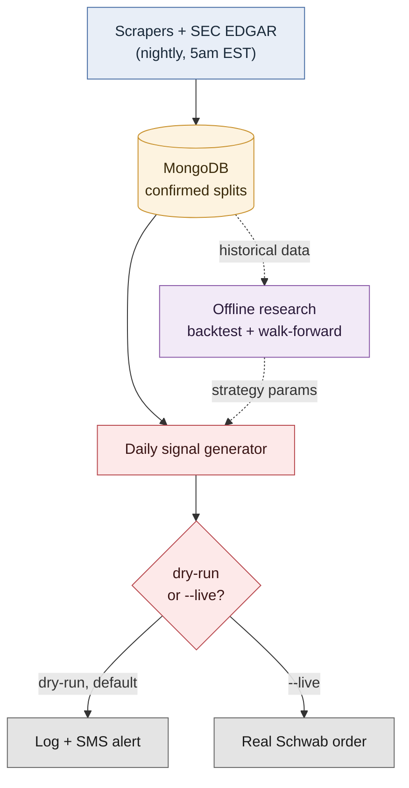

# System Architecture

How a reverse-split announcement becomes a dry-run order. Full detail on every stage
is in [REPORT.md](../REPORT.md); this is the shape of the pipeline, not the internals.

**The one thing to remember about this diagram:** research (purple) only flows *into*
live trading (red) as a fixed set of parameters — it doesn't run automatically or adapt
on its own. Changing the strategy means re-running the research and manually updating
those params.
