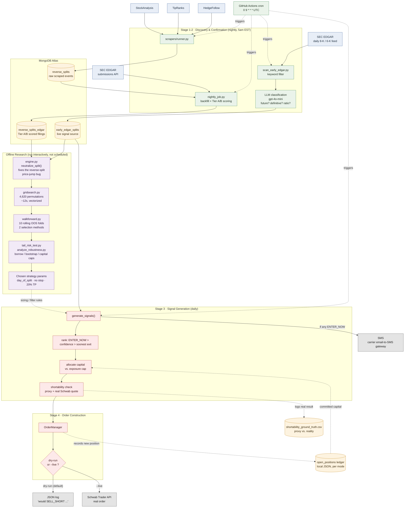

# System Architecture

This diagram shows the full system: how a reverse-split announcement becomes a
signal, how that signal became a strategy (offline research), and how a signal
becomes a dry-run order today.

See [REPORT.md](../REPORT.md) for the full narrative explanation of every stage.

## Reading the diagram

- **Blue** — external data sources (scrapers, SEC EDGAR)
- **Green** — the nightly/daily automated pipeline (also used for the CI scheduler)
- **Orange** — persistent storage (MongoDB collections, local JSON/CSV state)
- **Purple** — offline research — run by hand, not on a schedule; its only output that
  feeds the live system is the *chosen strategy params* box
- **Red** — the live daily signal + order path
- **Grey** — terminal actions/outputs (a log, a real order, a text message)

## Two loops worth noticing

1. **The research loop feeds the live loop, not the other way around.** Walk-forward
   validation happens offline against historical data; its only export to the live
   system is a fixed set of parameters (hold rule, stop, take-profit, gap filter).
   Changing the live strategy means re-running the research loop and updating those
   params — it does not happen automatically.
2. **The shortability ground-truth loop is closing slowly, live.** Every signal run
   (dry-run included) logs the proxy classifier's guess next to Schwab's real answer.
   That file is how the proxy gets calibrated over time — it's the only part of this
   diagram that learns from live operation.
