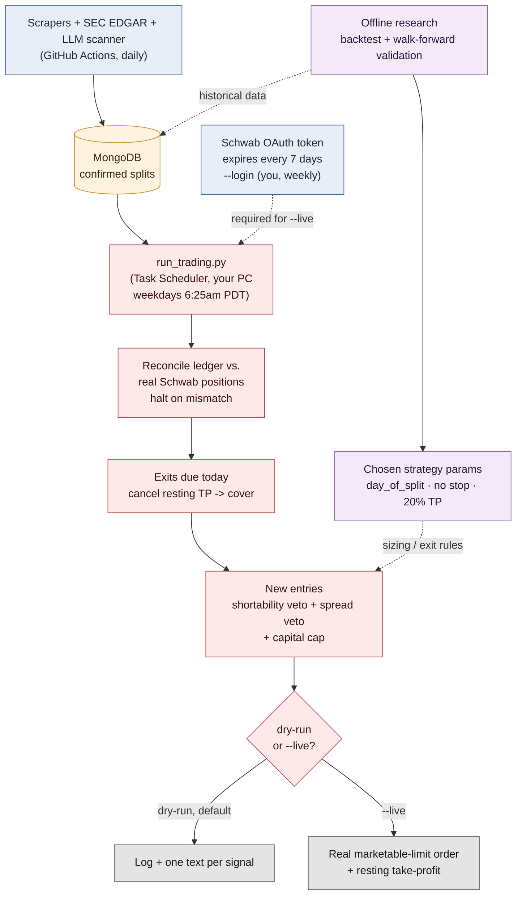

# System Architecture

How a reverse-split announcement becomes a trade. Full narrative detail is in
[REPORT.md](../REPORT.md) and [LIVE_DEPLOYMENT.md](LIVE_DEPLOYMENT.md); this is the
shape of the system, not the internals.

## What each piece is actually for

- **Data collection (blue, GitHub Actions)** — runs on its own schedule, never trades,
  needs no Schwab credentials. If this breaks, you get stale signals, not bad orders.
- **Offline research (purple)** — run by hand, not scheduled. Its only export to the
  live system is a fixed set of parameters. Changing the strategy means re-running
  this and manually updating those params — it never adapts on its own.
- **Live trading (red, your PC only)** — the only piece that can place real orders, and
  the only piece that needs the Schwab token. Every run reconciles against reality
  first and processes exits before ever considering a new entry.
- **Auth** — the one piece of "full automation" Schwab makes structurally impossible.
  You do the login; nothing else about the daily run needs you.

---

## Key decisions and why

- **Everything lives in a private repo you own**, not the original shared one — no one
  else can see any of this work.
- **Strategy B, not Strategy A** — `day_of_split` entry, no stop-loss, 20% take-profit.
  Chosen over the higher-raw-return alternative because its drawdown is far shallower
  (−3.5% vs. −14.3%) and it survives a 200%/yr borrow-cost stress test that the other
  strategy doesn't.
- **No stop-loss, on purpose** — tested directly by forcing stops back in at six
  levels; every level made returns *and* drawdown worse. These microcaps spike and
  revert before the exit date; a stop locks in the spike instead of riding it out.
- **Position size (2%), not a stop, is the tail-risk control** — capped low deliberately
  below the 5% used in backtesting, since sizing is what actually bounds a single bad
  trade, and this is unproven in live conditions.
- **No cap on concurrent positions** — only the 100% total-exposure ceiling limits how
  much can be committed at once. A per-position-count cap would arbitrarily reject good
  signals; the exposure ceiling already prevents overcommitment.
- **Real bid/ask spread check before every order** — sub-$1 stocks can have 10%+
  spreads; orders are marketable limits, not market orders, and anything wider than 5%
  (chosen by backtest sweep) is skipped outright rather than filled badly.
- **Live trading runs only on your PC, never in CI** — Schwab's 7-day token needs an
  interactive browser login GitHub Actions can't do, so trading requires a machine that
  stays logged in and holds persistent state. GitHub Actions does data collection only.
- **Dry-run is the default everywhere** — `--live` is opt-in and separately gated;
  nothing places a real order without both flags explicitly set.
- **One alert per signal, one source of alerts** — the old GitHub Actions alert step
  was removed once the real live-trading path went in, so there's exactly one system
  that can text you, on the real trading schedule, not two overlapping ones.
- **310+ tests run in CI on every push**, entirely offline (no live secrets needed) —
  including a regression test for the exact auth bug that broke `--login` in practice.
